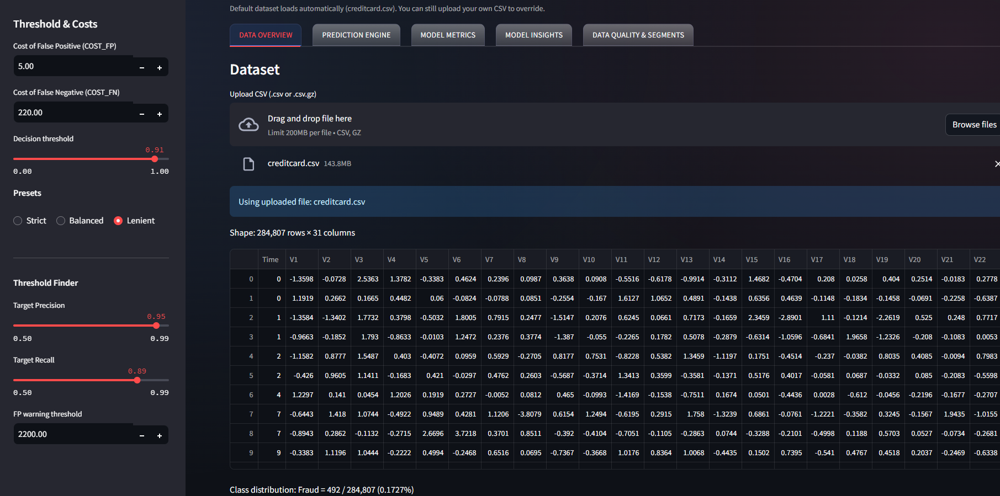
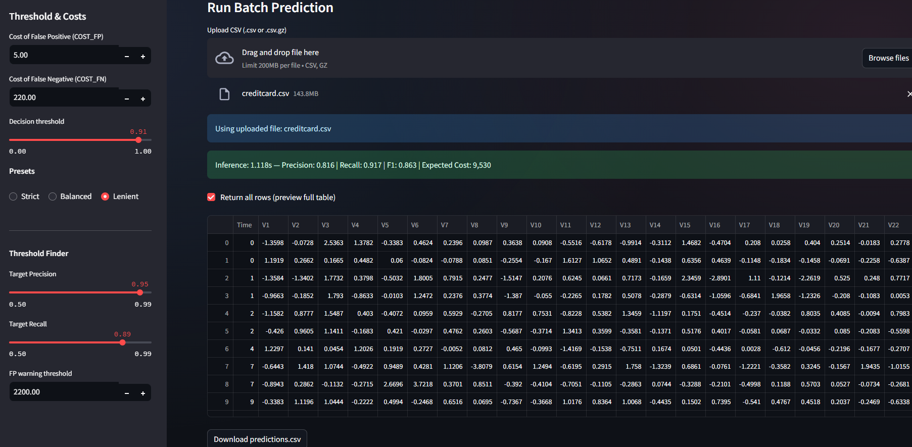
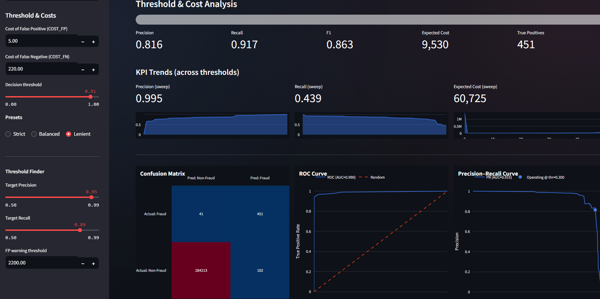
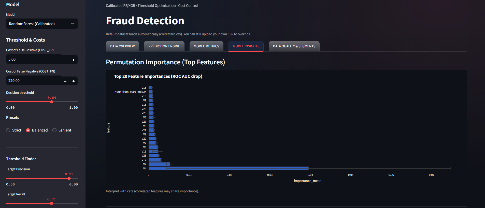
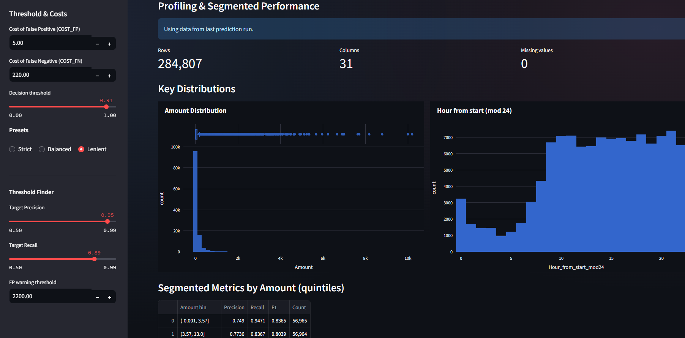

# 💳 Credit Card Fraud Detection Dashboard

[](https://streamlit.io/)  
[](LICENSE)  
[](https://github.com/tarekmasryo)

---


## 📌 Overview

Interactive dashboard built with **Streamlit, Plotly, and Scikit-learn** for real-time **fraud detection analysis**.  
It demonstrates a **business-aware ML pipeline** on the classic **Credit Card Fraud Dataset** (284,807 transactions, only 492 frauds ≈ 0.17%).  

- 🔍 Upload your own transaction CSV or use the built-in dataset  
- ⚖️ Custom decision thresholds with cost-sensitive analysis  
- 📊 Confusion matrix, ROC/PR curves, and cost–threshold visualization  
- 💡 Permutation feature importance for interpretability  
- 🧾 Segmented performance profiling (by amount, time of day, etc.)

---

## 📊 Dashboard Preview

### Data Overview  


### Prediction Engine  


### Model Metrics  


### Model Insights  


### Data Quality & Segments  


---

## 🔑 Features

- **Models**: RandomForest & XGBoost (calibrated)  
- **Presets**: Strict / Balanced / Lenient thresholds  
- **Threshold Finder**: auto-select by target Precision/Recall  
- **Cost Analysis**: business-aligned FP vs FN costs  
- **Visuals**: Confusion matrix, ROC, PR, cost vs threshold curves  
- **Insights**: Permutation importance, segmented KPIs  
- **Data Handling**: automatic schema validation + engineered features (`log(Amount)`, business hours, night proxy)

---

## 🚀 Run Locally

Clone the repo and install requirements:

```bash
git clone https://github.com/tarekmasryo/fraud-detection-dashboard.git
cd fraud-detection-dashboard
pip install -r requirements.txt
```

Run the app:

```bash
streamlit run app.py
```

---


## Related Repositories
- 🔍 [Fraud Detection EDA + Baseline Models](https://github.com/tarekmasryo/creditcard-fraud-detection)


If you use this dashboard,  please credit as:

> Fraud Detection  Dashboard by **Tarek Masryo**.\
> Code licensed under Apache 2.0