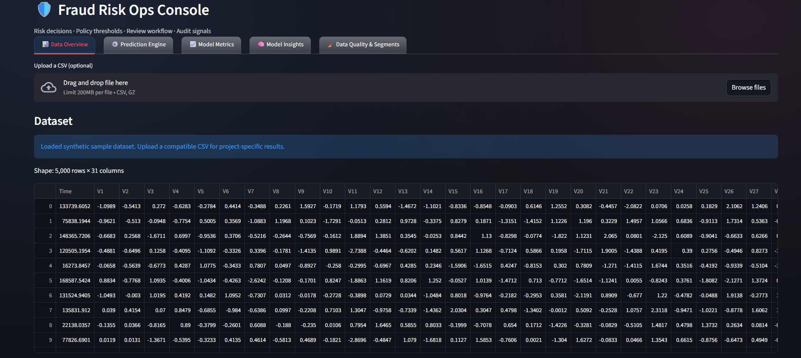
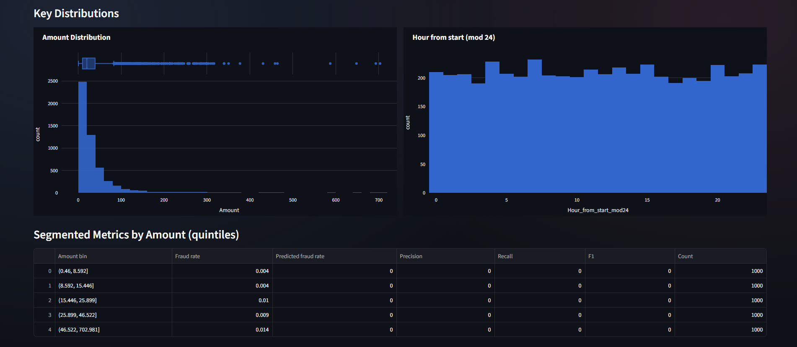
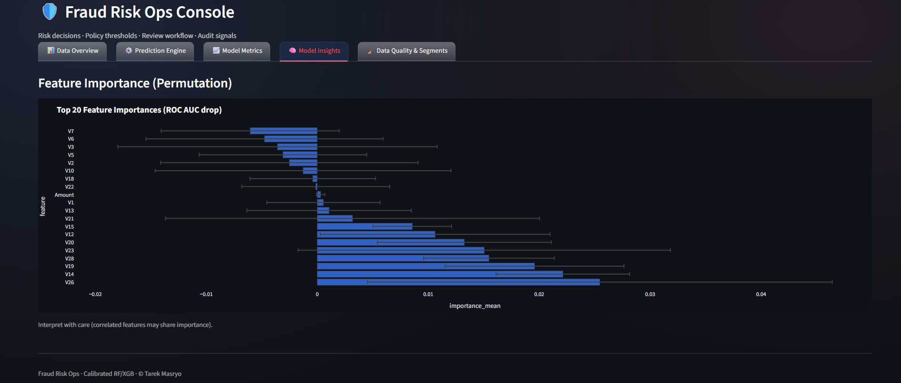
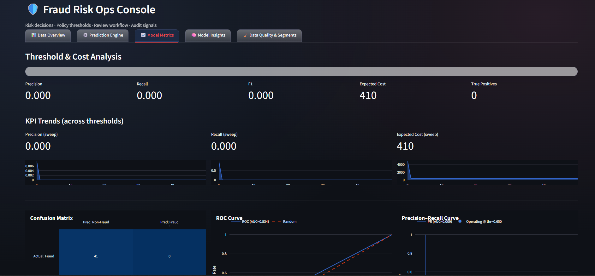
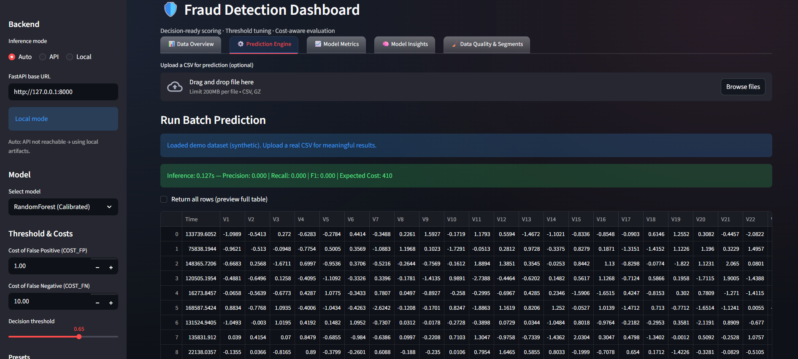
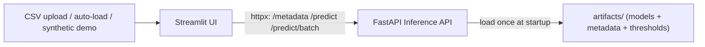

# Fraud Detection Dashboard — Decision-Ready UI + FastAPI Inference

[](../../actions/workflows/ci.yml)
[](https://www.python.org/)
[](https://fastapi.tiangolo.com/)
[](https://streamlit.io/)
[](LICENSE)

A **decision-first** fraud screening mini-system with a clean separation between **inference** and **analytics UI**:

- **FastAPI** inference service: `/health`, `/metadata`, `/predict`, `/predict/batch`
- **Streamlit** dashboard: data overview + batch scoring + thresholds + metrics + segments
- **Pre-trained artifacts** in `artifacts/`: **RandomForest + XGBoost** + **threshold policy**

> Runs out-of-the-box **with demo data**. For meaningful results, upload real labeled data (or place a compatible CSV locally).

---

## What you get

### Inference (FastAPI)
- Strict input validation (schema-driven)
- Single-record and batch scoring
- Model selection (`rf` / `xgb`) and threshold control
- Low-latency JSON responses with measured `latency_ms`

### Analytics UI (Streamlit)
- Upload a CSV or auto-load a local dataset (if present)
- Built-in **synthetic demo dataset** when no data is available
- **Decision policy presets** + custom thresholding
- Metrics + diagnostic plots + segmented analysis

---

## Decision policy presets

Policy presets are just **safe defaults** for the operating threshold:

| Preset | Intent | Typical effect |
|---|---|---|
| **Strict** | Minimize false positives | Higher threshold → fewer flagged cases, may miss more fraud |
| **Balanced** | Default trade-off | Mid threshold → balanced precision/recall |
| **Lenient** | Maximize recall | Lower threshold → catch more fraud, more false positives |

You can always override the threshold manually in the UI.

---

## Dashboard preview

### Data overview


### Prediction engine


### Model metrics


### Model insights


### Data quality & segments


---

## Architecture


```mermaid
flowchart LR
  DATA["CSV upload / auto-load / synthetic demo"] --> UI["Streamlit UI"]
  UI -->|"httpx: /metadata /predict /predict/batch"| API["FastAPI Inference API"]
  API -->|"load once at startup"| ART["artifacts/ (models + metadata + thresholds)"]
```

Key modules:

- `src/fraud_dashboard/api/` — FastAPI app (loads artifacts once, validates input, returns strict JSON)
- `src/fraud_dashboard/ui/` — Streamlit UI (calls the API via `httpx`)
- `src/fraud_dashboard/data/` — schema validation + synthetic demo generator
- `artifacts/` — serialized models + `metadata.json` + `thresholds.json`
- `tests/` — API + artifact loading + contract sanity checks

---

## Prerequisites

- Python 3.11+ (recommended). Streamlit Cloud runs on Python 3.13.
- Docker Desktop (for Docker Compose quickstart)

---

## Quickstart (local)

### 1) Create venv + install

**Windows PowerShell**
```powershell
py -3.11 -m venv .venv
.\.venv\Scripts\Activate.ps1
python -m pip install -U pip setuptools wheel
pip install -r requirements.txt -r requirements-dev.txt
pip install -e .
```

**Linux/macOS**
```bash
python3.11 -m venv .venv
source .venv/bin/activate
python -m pip install -U pip setuptools wheel
pip install -r requirements.txt -r requirements-dev.txt
pip install -e .
```

### 2) Run the API

Recommended (repo entrypoint):
```bash
python api.py
```

Alternative (standard Uvicorn):
```bash
uvicorn fraud_dashboard.api.app:app --host 127.0.0.1 --port 8000
```

Open:
- API docs: `http://127.0.0.1:8000/docs`
- Health: `http://127.0.0.1:8000/health`
- Metadata: `http://127.0.0.1:8000/metadata`

### 3) Run the UI
```bash
python -m streamlit run app.py
```

Open: `http://127.0.0.1:8501`

> On Windows, prefer `python -m streamlit ...` to ensure you're using the venv-installed Streamlit (avoid global `AppData\Roaming` installs).

> Streamlit Cloud entrypoint is `streamlit_app.py`. Local entrypoint is `app.py`.

---

## Quickstart (Docker Compose)

Runs two containers: `api` and `ui`.

### Run
```bash
docker compose up --build
```

### Run in background (optional)
```bash
docker compose up -d --build
```

### Logs
```bash
docker compose logs -f
```

### Stop
```bash
docker compose down
```

Open:
- API: `http://127.0.0.1:8000`
- UI: `http://127.0.0.1:8501`

The UI container calls the API at `http://api:8000` via Compose service DNS.

### Troubleshooting: port is already allocated

If you see `Bind for 0.0.0.0:8501 failed: port is already allocated`:

- Stop the process/container using the port, **or**
- Change the host port mapping in `docker-compose.yml` (e.g. `"8502:8501"`) and re-run `docker compose up --build`.

---

## Data (optional)

The UI supports **uploaded CSVs**.

Auto-load behavior:
- If `creditcard.csv` exists in one of the search paths below, the UI loads it automatically.
- Otherwise, the UI generates a **synthetic demo dataset** (same schema) so the dashboard remains runnable.

Default search paths:

- `data/creditcard.csv` *(recommended)*
- `creditcard.csv` *(repo root)*
- `data/demo_creditcard.csv`
- `/mnt/data/creditcard.csv`

Dataset sources are **not redistributed** in this repo. See `DATA_LICENSE.md` for attribution and terms.

### Download via Kaggle CLI (optional)
```bash
pip install kaggle
kaggle datasets download -d mlg-ulb/creditcardfraud -p data --unzip
```

---

## Configuration

Environment variables:

- `FRAUD_API_URL` (preferred): FastAPI base URL for the Streamlit UI  
  Examples:
  - local: `http://127.0.0.1:8000`
  - compose: `http://api:8000`
- `API_BASE_URL` (back-compat): same purpose

See: `.env.example`

---

## API usage

### Endpoints
- `GET /health`
- `GET /metadata`
- `POST /predict`
- `POST /predict/batch`

### Example request (Python)
```python
import httpx

meta = httpx.get("http://127.0.0.1:8000/metadata").json()
features = meta["schema"]["features"]

record = {f: 0.0 for f in features}
resp = httpx.post(
    "http://127.0.0.1:8000/predict",
    json={"record": record, "model": "rf"},
).json()
print(resp)
```

### Example request (PowerShell)
```powershell
./scripts/predict.ps1 -ApiUrl "http://127.0.0.1:8000" -Model rf
```

> Model + threshold can be passed in the request body, or via query parameters for quick manual testing. If both are present, query parameters take precedence.

### Response format
A successful `/predict` response is strict JSON:

```json
{
  "model": "rf",
  "threshold": 0.05348,
  "proba_fraud": 0.00033,
  "label": 0,
  "latency_ms": 49
}
```

---

## Testing & quality gates

```bash
ruff check .
ruff format --check .
pytest -q
```

Optional (visibility only):
```bash
pip-audit
```

CI runs: Ruff + Pytest + Docker build stage (`.github/workflows/ci.yml`).

---

## Dependency policy (artifact-locked)

This repo ships **pre-trained serialized artifacts** (`artifacts/*.joblib`). To keep the project runnable out of the box, the ML/data stack is **pinned** to the training-time versions.

> Note (Streamlit Cloud): Streamlit Cloud runs on Python 3.13, so `requirements.txt` uses environment markers to keep the artifact stack stable on Python 3.11/3.12 while remaining wheel-installable on Python 3.13.

If you want to upgrade dependencies, treat it as a **refresh cycle**:

1) upgrade deps  
2) re-export artifacts (via `scripts/train.py`)  
3) update `artifacts/metadata.json`  
4) re-run tests  

---

## Project structure

```text
.
├─ api.py                     # FastAPI entrypoint (robust for src layout)
├─ app.py                     # Local Streamlit entrypoint
├─ streamlit_app.py           # Streamlit Cloud entrypoint
├─ src/                       # package code (src layout)
├─ artifacts/                 # pre-trained models + threshold policy
├─ scripts/                   # utility scripts (PowerShell + training)
├─ tests/                     # unit + contract tests
├─ docker-compose.yml
├─ Dockerfile
└─ docs/CASE_STUDY.md
```

---

## Security

See: `SECURITY.md`

---

## Case study

See: `docs/CASE_STUDY.md`

---

## License & attribution

- Code license: MIT — see `LICENSE`.
- Dataset is not redistributed. If you download it, follow the dataset terms — see `DATA_LICENSE.md`.
