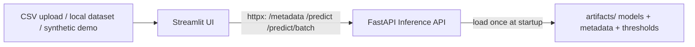

# Fraud Detection Dashboard — Decision-Ready UI + FastAPI Inference

[](https://github.com/tarekmasryo/fraud-detection-dashboard/actions/workflows/ci.yml)
[](https://www.python.org/)
[](https://fastapi.tiangolo.com/)
[](https://streamlit.io/)
[](LICENSE)

A **decision-ready fraud screening dashboard** with a clean split between **model inference** and **operator-facing analytics**.

The project combines:

- **FastAPI** inference endpoints for single-record and batch scoring
- **Streamlit** dashboard for exploration, scoring, thresholds, metrics, and segment review
- **Pre-trained RandomForest and XGBoost artifacts** with a reusable threshold policy
- **Docker Compose** setup for a reproducible API + UI runtime

> The app runs out of the box with synthetic demo data. For real analysis, upload a compatible labeled CSV or place the expected dataset locally.

---

## What this repo demonstrates

### FastAPI inference service

- Schema-driven request validation
- Single-record and batch prediction endpoints
- Model selection with `rf` / `xgb`
- Configurable decision threshold
- Low-latency JSON responses with measured `latency_ms`
- Metadata endpoint exposing feature schema and model policy

### Streamlit analytics dashboard

- CSV upload and local dataset auto-loading
- Synthetic fallback dataset with the expected schema
- Batch scoring workflow
- Threshold presets and custom threshold control
- Metrics, diagnostic plots, and segmented review views
- Data quality checks before prediction

---

## Decision policy presets

Policy presets provide practical defaults for the operating threshold.

| Preset | Intent | Typical effect |
|---|---|---|
| **Strict** | Reduce false positives | Higher threshold → fewer flagged transactions, more missed fraud risk |
| **Balanced** | Default operating trade-off | Mid threshold → balanced precision/recall behavior |
| **Lenient** | Increase fraud capture | Lower threshold → more flagged transactions, more review load |

You can override the threshold manually from the UI or API request.

---

## Dashboard preview

### Data overview


### Prediction engine


### Model metrics


### Model insights


### Data quality and segments


---

## Architecture


```mermaid
flowchart LR
  DATA["CSV upload / local dataset / synthetic demo"] --> UI["Streamlit UI"]
  UI -->|"httpx: /metadata /predict /predict/batch"| API["FastAPI Inference API"]
  API -->|"load once at startup"| ART["artifacts/ models + metadata + thresholds"]
```

Key modules:

- `src/fraud_dashboard/api/` — FastAPI app, artifact loading, validation, and response contracts
- `src/fraud_dashboard/ui/` — Streamlit dashboard and API client workflow
- `src/fraud_dashboard/data/` — schema helpers and synthetic demo data generator
- `artifacts/` — serialized models, feature metadata, and threshold policy
- `tests/` — API, artifact-loading, and contract checks

---

## Prerequisites

- **Python 3.11**
- **Docker Desktop** if you use the Docker Compose quickstart

> **Runtime note:** This project ships pre-trained `joblib` artifacts built for the Python 3.11 ML stack. If you upgrade Python or core ML dependencies, re-export the artifacts and update `artifacts/metadata.json`.

---

## Quickstart with Docker Compose

This is the most reproducible way to run both services.

```bash
docker compose up --build
```

Run in the background:

```bash
docker compose up -d --build
```

View logs:

```bash
docker compose logs -f
```

Stop the services:

```bash
docker compose down
```

Open:

- API: `http://127.0.0.1:8000`
- API docs: `http://127.0.0.1:8000/docs`
- UI: `http://127.0.0.1:8501`

The UI container calls the API at `http://api:8000` through Docker Compose service DNS.

### Port already allocated

If port `8501` is already in use:

- stop the process or container using the port, or
- change the host mapping in `docker-compose.yml`, for example:

```yaml
ports:
  - "8502:8501"
```

Then re-run:

```bash
docker compose up --build
```

---

## Quickstart locally

### 1. Create a virtual environment and install dependencies

#### Windows PowerShell

```powershell
py -3.11 -m venv .venv
.\.venv\Scripts\Activate.ps1
python -m pip install -U pip setuptools wheel
pip install -r requirements.txt -r requirements-dev.txt
pip install -e .
```

#### Linux / macOS

```bash
python3.11 -m venv .venv
source .venv/bin/activate
python -m pip install -U pip setuptools wheel
pip install -r requirements.txt -r requirements-dev.txt
pip install -e .
```

### 2. Run the API

Recommended repo entrypoint:

```bash
python api.py
```

Standard Uvicorn entrypoint:

```bash
uvicorn fraud_dashboard.api.main:app --host 127.0.0.1 --port 8000
```

Open:

- API docs: `http://127.0.0.1:8000/docs`
- Health: `http://127.0.0.1:8000/health`
- Metadata: `http://127.0.0.1:8000/metadata`

### 3. Run the Streamlit UI

```bash
python -m streamlit run app.py
```

Open:

- UI: `http://127.0.0.1:8501`

> On Windows, `python -m streamlit ...` is preferred because it uses the Streamlit package installed inside the active virtual environment.

---

## Streamlit Community Cloud

Use:

- Entry point: `streamlit_app.py`
- Python version: `3.11`

Select Python 3.11 from the deployment settings before launching the app.

For the most reproducible local or portfolio demo, Docker Compose is recommended.

---

## Data

The UI supports uploaded CSV files with the expected feature schema.

Auto-load order:

1. `data/creditcard.csv`
2. `creditcard.csv`
3. `data/demo_creditcard.csv`
4. `/mnt/data/creditcard.csv`

If no compatible dataset is found, the app generates a synthetic demo dataset so the dashboard remains runnable.

Dataset files are **not redistributed** in this repository. See `DATA_LICENSE.md` for attribution and terms.

### Optional Kaggle CLI download

```bash
pip install kaggle
kaggle datasets download -d mlg-ulb/creditcardfraud -p data --unzip
```

---

## Configuration

Environment variables:

| Variable | Purpose | Example |
|---|---|---|
| `FRAUD_API_URL` | Preferred FastAPI base URL for the Streamlit UI | `http://127.0.0.1:8000` |
| `API_BASE_URL` | Backward-compatible API URL variable | `http://api:8000` |

See `.env.example`.

---

## API usage

### Endpoints

- `GET /health`
- `GET /metadata`
- `POST /predict`
- `POST /predict/batch`

### Python request example

```python
import httpx

api_url = "http://127.0.0.1:8000"

metadata = httpx.get(f"{api_url}/metadata").json()
features = metadata["schema"]["features"]

record = {feature: 0.0 for feature in features}

response = httpx.post(
    f"{api_url}/predict",
    json={
        "record": record,
        "model": "rf",
    },
)

print(response.json())
```

### PowerShell request example

```powershell
./scripts/predict.ps1 -ApiUrl "http://127.0.0.1:8000" -Model rf
```

Model and threshold can be passed in the request body or as query parameters. If both are provided, query parameters take precedence.

### Example response

```json
{
  "model": "rf",
  "threshold": 0.05348,
  "proba_fraud": 0.00033,
  "label": 0,
  "latency_ms": 49
}
```

---

## Testing and quality gates

```bash
ruff check .
ruff format --check .
pytest -q
```

Optional dependency audit:

```bash
pip-audit
```

CI runs Ruff, Pytest, and the Docker build stage defined in `.github/workflows/ci.yml`.

---

## Runtime compatibility

The repository includes pre-trained serialized artifacts:

```text
artifacts/*.joblib
artifacts/metadata.json
artifacts/thresholds.json
```

The runtime is pinned to the Python 3.11 ML stack used for the exported artifacts.

If you upgrade Python or core ML dependencies, treat it as an artifact refresh cycle:

1. Upgrade dependencies.
2. Re-export artifacts with `scripts/train.py`.
3. Update `artifacts/metadata.json`.
4. Re-run the test suite.
5. Rebuild the Docker image.

---

## Project structure

```text
.
├─ api.py                     # FastAPI entrypoint for local runs
├─ app.py                     # Local Streamlit entrypoint
├─ streamlit_app.py           # Streamlit Community Cloud entrypoint
├─ src/                       # Package source code
├─ artifacts/                 # Pre-trained models and threshold policy
├─ scripts/                   # Utility scripts and training/export helpers
├─ tests/                     # Unit and contract tests
├─ docker-compose.yml
├─ Dockerfile
└─ docs/CASE_STUDY.md
```

---

## Security

See `SECURITY.md`.

---

## Case study

See `docs/CASE_STUDY.md`.

---

## License and attribution

- Code license: MIT — see `LICENSE`.
- Dataset files are not redistributed. If you download a dataset, follow its original terms — see `DATA_LICENSE.md`.
