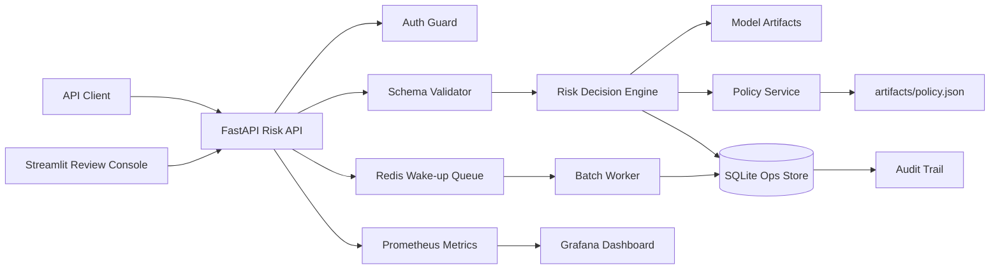

# 🛡️ Fraud Risk Ops Platform

[](https://github.com/tarekmasryo/fraud-risk-ops-platform/actions/workflows/ci.yml)
[](https://www.python.org/)
[](https://fastapi.tiangolo.com/)
[](https://streamlit.io/)
[](./VERSION)
[](LICENSE)

**Production-structured fraud risk operations platform** for fraud scoring, policy-driven decisions, review workflows, audit logging, worker-backed batch jobs, and monitoring-ready signals.

The system models the operational boundary around an ML risk decision:

```text
transaction record -> schema validation -> model score -> policy decision -> audit log -> review console -> metrics
```

---

## 🎯 Why this project matters

Fraud scoring is not only a model problem. A useful operational system needs stable contracts, policy review, auditability, batch processing, and visibility into runtime behavior.

This project demonstrates those production-minded boundaries around an ML decision system:

- explicit API contracts
- model/policy separation
- strict input validation
- fail-closed artifact readiness
- persisted audit trails
- worker-backed batch-job lifecycle
- Prometheus/Grafana observability hooks
- documented engineering trade-offs

---

## ✨ What this repo demonstrates

| Layer | Implementation |
|---|---|
| **Risk API** | FastAPI `/v1` endpoints for prediction, policy, jobs, audit logs, and model metadata. |
| **Review Console** | Streamlit UI for scoring, threshold review, model views, data quality checks, and operational slices. API mode chunks large batches automatically to respect backend limits. |
| **Policy Governance** | `artifacts/policy.json` is the threshold source of truth for API and UI; UI policy/manual threshold selections are forwarded to the API in API mode. |
| **Decision Contract** | Responses include `risk_score`, `decision`, `review_required`, `risk_band`, `reason_codes`, `policy_version`, and `input_hash`. |
| **Readiness Gate** | `/ready` validates metadata, schema, policy, model files, runtime compatibility, checksums, and sample scoring. |
| **Persistence** | SQLite operations store for prediction requests, row-level predictions, audit logs, and batch jobs. |
| **Batch Work** | Docker Compose runs API + worker; SQLite is source of truth and Redis is a wake-up queue. |
| **Observability** | `/metrics`, `/v1/metrics/summary`, Prometheus config, and provisioned Grafana dashboard. |
| **Quality Gates** | Ruff, Pytest, coverage config, Dockerfile, Docker Compose, `.dockerignore`, `.gitignore`, and CI workflow. |

---

## 🧭 Architecture


```mermaid
flowchart LR
  Client["API Client"] --> API["FastAPI Risk API"]
  UI["Streamlit Review Console"] --> API
  API --> Auth["Auth Guard"]
  API --> Validator["Schema Validator"]
  Validator --> Engine["Risk Decision Engine"]
  Engine --> Models["Model Artifacts"]
  Engine --> Policy["Policy Service"]
  Policy --> PolicyFile["artifacts/policy.json"]
  Engine --> Store[("SQLite Ops Store")]
  Store --> Audit["Audit Trail"]
  API --> Queue["Redis Wake-up Queue"]
  Queue --> Worker["Batch Worker"]
  Worker --> Store
  API --> Metrics["Prometheus Metrics"]
  Metrics --> Grafana["Grafana Dashboard"]
```

Core package map:

```text
src/fraud_dashboard/
├─ api/                 # FastAPI app and versioned API surface
├─ core/                # config, policy, decision logic, artifacts, security, readiness
├─ data/                # synthetic data and validation helpers
├─ observability/       # Prometheus metrics
├─ platform/            # SQLite store, jobs, audit persistence, Redis wake-up queue
├─ services/            # application services for scoring, jobs, reference data, and summaries
├─ ui/                  # Streamlit review console
└─ workers/             # batch worker entrypoint
```

See [`docs/ARCHITECTURE.md`](docs/ARCHITECTURE.md) and [`docs/ENGINEERING.md`](docs/ENGINEERING.md).

---

## 🖼️ Screenshots

| Data Overview | Prediction Engine | Model Metrics |
|---|---|---|
|  |  |  |

| Model Insights | Data Quality |
|---|---|
|  |  |

---

## 🚀 Quickstart with Docker Compose

```bash
docker compose up --build
```

Open:

| Service | URL |
|---|---|
| API docs | `http://127.0.0.1:8000/docs` |
| Review console | `http://127.0.0.1:8501` |
| Prometheus | `http://127.0.0.1:9090` |
| Grafana | `http://127.0.0.1:3000` |

Stop:

```bash
docker compose down
```

Remove local Docker volumes when you want a clean runtime store:

```bash
docker compose down -v
```

If Docker Compose fails with `Bind for 0.0.0.0:6379 failed: port is already allocated`, another Redis instance is already using the host port. Redis is only required inside the Docker network by the API and worker, so you can remove the Redis host `ports` mapping or change it to `6380:6379`.

---

## 🧪 Quickstart locally

> The official runtime target is Python 3.11. Patch-level Python 3.11 differences may appear as readiness warnings when artifact checks and sample scoring pass.

```bash
python3.11 -m venv .venv
source .venv/bin/activate
python -m pip install -U pip setuptools wheel
pip install -r requirements.txt -r requirements-dev.txt
pip install -e .
```

Run API:

```bash
python api.py
```

Run UI:

```bash
FRAUD_API_URL=http://127.0.0.1:8000 python -m streamlit run app.py --server.port 8501
```

Any available Streamlit port is fine. For example, use `--server.port 8503` if `8501` is already in use. The important part is that `FRAUD_API_URL` points to the running API.

Run quality checks:

```bash
ruff format --check .
ruff check .
pytest -q --cov=src --cov-fail-under=75
```

### Windows PowerShell

```powershell
py -3.11 -m venv .venv
.\.venv\Scripts\Activate.ps1
python -m pip install -U pip setuptools wheel
pip install -r requirements.txt -r requirements-dev.txt
$env:PYTHONPATH="src"
$env:REQUIRE_AUTH="false"
python -m uvicorn fraud_dashboard.api.main:app --host 127.0.0.1 --port 8000
```

In a second PowerShell window:

```powershell
.\.venv\Scripts\Activate.ps1
$env:PYTHONPATH="src"
$env:FRAUD_API_URL="http://127.0.0.1:8000"
python -m streamlit run app.py --server.port 8501
```

---

## 🔌 API surface

Runtime checks:

```text
GET /live
GET /ready
GET /metadata
GET /metrics
```

Versioned platform API:

```text
POST /v1/auth/login
GET  /v1/me
POST /v1/predictions
POST /v1/predictions/batch
POST /v1/batch-jobs
GET  /v1/jobs/{job_id}
GET  /v1/audit-logs
GET  /v1/policies
GET  /v1/metrics/summary
GET  /v1/model-versions
```

Prediction requests use the packaged credit-card fraud feature contract: `Time`, `V1` through `V28`, and `Amount`. The default model key is `rf`; `xgb` is also available when the matching artifact is present. Use `POST /v1/predictions` for one record and `POST /v1/predictions/batch` for multiple records.

For interactive request testing, open `http://127.0.0.1:8000/docs`. For the full request and response contract, see [`docs/API.md`](docs/API.md).

Example response shape:

```json
{
  "model": "rf",
  "threshold": 0.0534831589433206,
  "proba_fraud": 0.0123,
  "risk_score": 0.0123,
  "label": 0,
  "decision": "approve",
  "review_required": false,
  "risk_band": "low",
  "reason_codes": ["score_below_policy_threshold", "risk_band_low"],
  "policy": "min_cost",
  "policy_version": "fraud-risk-ops-v0.1.0",
  "input_hash": "...",
  "latency_ms": 12,
  "request_id": "pred_..."
}
```

---

## 🧩 Policy governance

`artifacts/policy.json` is the source of truth for operating thresholds. The API and UI read the same policy file to avoid backend/UI drift. In API mode, the Streamlit console forwards the selected policy preset or manual threshold to the API, then chunks large scoring runs according to the backend `MAX_BATCH_RECORDS` limit.

Current operating policies:

| Policy | Intent |
|---|---|
| `strict` | Reduce false positives and analyst load. |
| `balanced` | Default review-oriented operating point. |
| `min_cost` | Cost-aware packaged reference operating point; regenerate artifacts for target-data holdout metrics. |
| `lenient` | Increase fraud capture with higher review load. |

Explicit invalid policy requests fail with `400` instead of silently falling back to another threshold. That behavior is deliberate: policy selection is part of the decision contract.

---

## ✅ Artifact readiness

Use:

```text
GET /ready
```

The readiness check validates:

- metadata presence
- schema feature contract
- policy file presence
- model artifact presence
- artifact checksums against the expected SHA-256 manifest in `metadata.json`
- runtime compatibility against metadata
- sample scoring without compatibility fallback

Readiness fails closed for missing artifacts, checksum mismatches, schema/policy errors, or incompatible runtime failures. Patch-level Python 3.11 differences may be reported as warnings when artifact checks and sample scoring pass. The API does not silently replace a broken serialized model with heuristic scores.

---

## ⚙️ Configuration

Copy `.env.example` and adjust values as needed.

| Variable | Purpose | Default |
|---|---|---|
| `DATABASE_URL` | Local operations persistence store | `sqlite:///./data/fraud_ops.db` |
| `MAX_BATCH_RECORDS` | Batch scoring safety limit | `1000` |
| `RUN_JOBS_IN_API` | Run jobs inside API process for one-process local runs | `true` |
| `WORKER_POLL_SECONDS` | Worker poll interval when Redis wake-up is unavailable | `2` |
| `APP_ENV` | Runtime environment guard; `prod` requires auth | `dev` |
| `REQUIRE_AUTH` | Protect scoring and operational endpoints | `false` |
| `CORS_ALLOW_ORIGINS` | Comma-separated browser origins allowed for API clients | local Streamlit origins |
| `DEMO_API_KEY` / `DEMO_API_KEY_HASH` | Backend API key or HMAC digest when auth is enabled | replace before protected runs |
| `FRAUD_API_KEY` / `FRAUD_BEARER_TOKEN` | Optional Streamlit-to-API auth forwarding | empty |
| `STRICT_ARTIFACT_RUNTIME` | Fail `/ready` on incompatible artifact/runtime failures | `true` |
| `ALLOW_ARTIFACT_COMPATIBILITY_FALLBACK` | Opt-in local UI compatibility fallback only | `false` |
| `ALLOW_LOCAL_FALLBACK` | Allow UI to use local artifacts if API is down | `true` |
| `PROMETHEUS_ENABLED` | Expose Prometheus metrics endpoint | `true` |

For protected local runs, set strong non-default values:

```bash
REQUIRE_AUTH=true
JWT_SECRET_KEY=<strong-secret>
API_KEY_HASH_SECRET=<strong-hmac-secret>
DEMO_API_KEY=<strong-api-key>
# optional: DEMO_API_KEY_HASH=<hmac-sha256-api-key-digest>
ADMIN_PASSWORD=<strong-password>
# optional for Streamlit-to-API protected mode:
FRAUD_API_KEY=<same-strong-api-key>
GRAFANA_ADMIN_PASSWORD=<strong-local-grafana-password>
```

The app refuses insecure local secrets when `REQUIRE_AUTH=true`. It also refuses `APP_ENV=prod` unless auth is enabled, and rejects wildcard CORS in prod-like environments. Scoring, operational endpoints, and `/metadata` require authentication in protected mode. The Streamlit console can also forward protected-mode credentials through `FRAUD_API_KEY`, `FRAUD_BEARER_TOKEN`, or the sidebar auth fields.

---

## 🧠 Training and metric boundary

The packaged artifacts are reference artifacts for running and reviewing the platform. They are not presented as operational benchmark claims. To regenerate deployable model artifacts, run `scripts/train.py`; the script uses separate splits for model training, calibration/threshold selection, and final holdout-test metric reporting.

```bash
python scripts/train.py --data data/creditcard.csv --out artifacts --label Class
```

The resulting `metadata.json` records the split contract and stores expected SHA-256 checksums for readiness validation.

---

## 📦 Data

This repository does not redistribute the original credit-card fraud dataset. The UI can run with synthetic data and accepts compatible uploaded CSV files.

Auto-load order:

1. `data/creditcard.csv`
2. `creditcard.csv`
3. `data/demo_creditcard.csv`
4. `/mnt/data/creditcard.csv`

See [`DATA_LICENSE.md`](DATA_LICENSE.md).

---

## 📚 Documentation

| Doc | Purpose |
|---|---|
| [`docs/ARCHITECTURE.md`](docs/ARCHITECTURE.md) | System boundaries, runtime flows, governance, and deployment topology. |
| [`docs/ENGINEERING.md`](docs/ENGINEERING.md) | Clean-code boundaries, design patterns, and why the repo stays compact. |
| [`docs/API.md`](docs/API.md) | Endpoint reference and request/response contract. |
| [`docs/OPERATIONS.md`](docs/OPERATIONS.md) | Local operations, runtime checks, worker mode, and monitoring. |
| [`docs/JOB_LIFECYCLE.md`](docs/JOB_LIFECYCLE.md) | Persisted async batch-job lifecycle. |
| [`docs/DATABASE_SCHEMA.md`](docs/DATABASE_SCHEMA.md) | SQLite operational tables. |
| [`docs/TRADEOFFS.md`](docs/TRADEOFFS.md) | Engineering trade-offs behind persistence, queueing, auth, artifacts, and Docker. |
| [`docs/SCOPE.md`](docs/SCOPE.md) | Release scope and operational boundaries. |
| [`docs/CASE_STUDY.md`](docs/CASE_STUDY.md) | Short system-design framing. |
| [`SECURITY.md`](SECURITY.md) | Security policy and protected-mode boundary. |
| [`CHANGELOG.md`](CHANGELOG.md) | Release notes. |

---

## 📌 Release scope

This release focuses on the engineering system around fraud-risk decisions:

- model serving through stable API contracts
- threshold policy governance
- auditable prediction and batch-job records
- seeded model-version and threshold-policy reference tables
- review-oriented Streamlit interface
- worker-backed batch processing
- Prometheus/Grafana observability
- Docker Compose deployment for local technical review

The repository uses synthetic/local runtime defaults and does not ship real customer data, payment-network integrations, tenant isolation, billing, or regulatory-compliance workflows. Those boundaries keep the release focused, runnable, and technically inspectable.

---

## 📄 License and attribution

- Code license: MIT — see [`LICENSE`](LICENSE).
- Dataset files are not redistributed. Follow original dataset terms when using external data.
