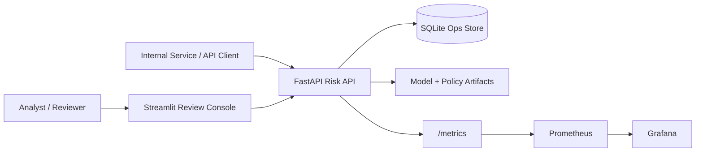
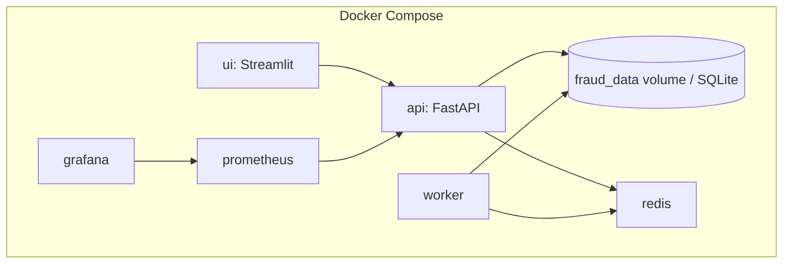
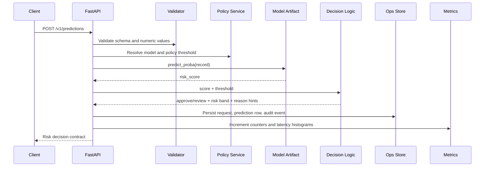
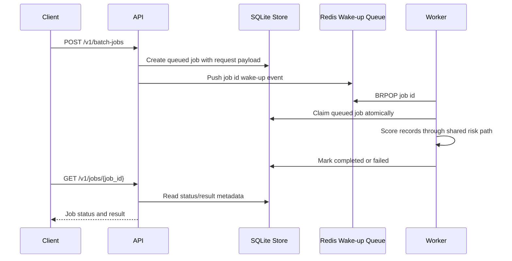

# Architecture

Fraud Risk Ops is a production-structured ML risk operations platform. It keeps the local setup compact while implementing the operating layers around an ML model: API contracts, policy governance, persistence, audit logging, batch processing, readiness checks, and metrics.

The design goal is **production-structured and inspectable**: enough operational depth to show system thinking while keeping the release runnable and easy to review.

---

## System context



The repository is built for local technical review. SQLite and Docker Compose keep the setup reproducible while preserving the important system boundaries: persisted state, worker execution, policy governance, and monitoring.

---

## Container topology



SQLite is the source of truth for jobs and audit records. Redis is used as a wake-up queue for the worker, keeping the runtime focused and inspectable.

---

## Package boundaries

```text
src/fraud_dashboard/
├─ api/                 # HTTP app, request/response models, thin route orchestration
├─ core/                # domain logic: config, policy, decisions, artifacts, readiness, security
├─ data/                # synthetic data and input validation helpers
├─ observability/       # Prometheus counters, histograms, and rendering
├─ platform/            # operational persistence, jobs, audit records, Redis wake-up queue
├─ services/            # scoring, batch-job execution, reference data, summaries
├─ ui/                  # Streamlit review console, pages, API/local predictor adapters
└─ workers/             # batch worker process entrypoint
```

### Boundary rules

- `api/` stays thin: validate request, call application services, return explicit response contracts.
- `core/` does not depend on Streamlit or HTTP rendering.
- `platform/` owns persistence and operational state.
- `ui/` can use either the API adapter or local artifacts for technical review, but API mode is the preferred system path.
- `workers/` claims persisted jobs and reuses the shared `services.scoring` path without importing private API route functions.

---

## Request lifecycle



Key rule: **model score and policy decision are separate**.

```text
model artifact -> risk_score
policy document -> threshold
decision layer -> approve / review
```

This avoids baking an operating threshold into the model artifact and makes policy review easier.

---

## Batch-job lifecycle



The worker can still poll SQLite when Redis is unavailable. That keeps the runtime durable enough for local review while avoiding an inflated queue architecture.

---

## Policy governance

`artifacts/policy.json` is the threshold source of truth.

The policy file defines:

- `policy_version`
- default model
- default policy
- policy names
- per-model thresholds
- risk-band definitions
- public decision contract notes

Explicit invalid policy requests fail with `400`. Silent fallback is only tolerated for legacy threshold migration when no policy document is available.

---

## Artifact readiness

`GET /ready` is stricter than liveness.

Readiness validates:

- metadata file
- schema feature list
- policy file
- model artifact files
- artifact checksums against the expected SHA-256 manifest
- runtime version compatibility
- sample scoring with compatibility fallback disabled

By default, artifact/runtime mismatch returns `503`. This is intentional. The system does not appear ready when the serialized ML artifacts cannot score reliably in the configured runtime.

---

## Observability

The API exposes Prometheus text-format metrics at `/metrics`.

Metric categories include:

- HTTP request counts by method/path/status
- HTTP request duration
- prediction counts by model/source
- prediction latency
- high-risk count
- policy usage
- batch-job status counts
- prediction error counts

Grafana is provisioned in Docker Compose for local inspection. Alerting rules are intentionally left out of the public reference and documented as a production hardening step.

---

## Security boundary

Authentication is environment-controlled:

- `REQUIRE_AUTH=false` keeps local technical review frictionless.
- `REQUIRE_AUTH=true` enables JWT/API-key gates.
- `APP_ENV=prod` fails fast unless auth is enabled.
- Wildcard CORS is rejected in prod-like environments.
- Unsafe default secrets are rejected when protected mode is enabled.

The release includes protected API flows, configurable CORS, and explicit secret validation for local review. Security-sensitive production integrations are intentionally kept outside this public release scope.

---

## Why this architecture is intentionally compact

This repository implements platform engineering around ML decisions without shipping unnecessary public complexity. The release keeps multi-tenancy, billing, Kubernetes, a model-registry service, and full retraining orchestration outside scope so the implemented system remains runnable, focused, and technically inspectable.

The intended signal is clear: **production-minded system boundaries around ML risk decisions**.
